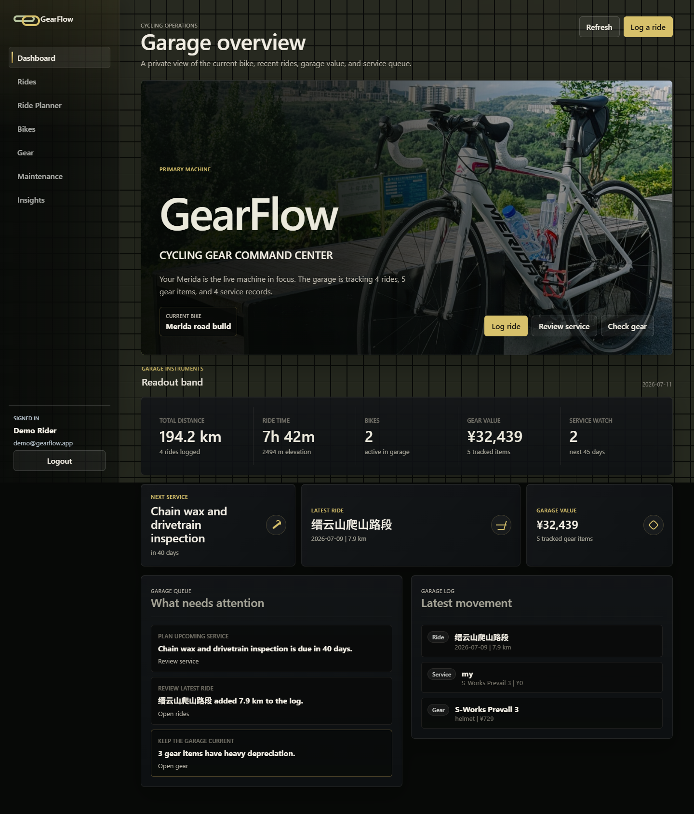
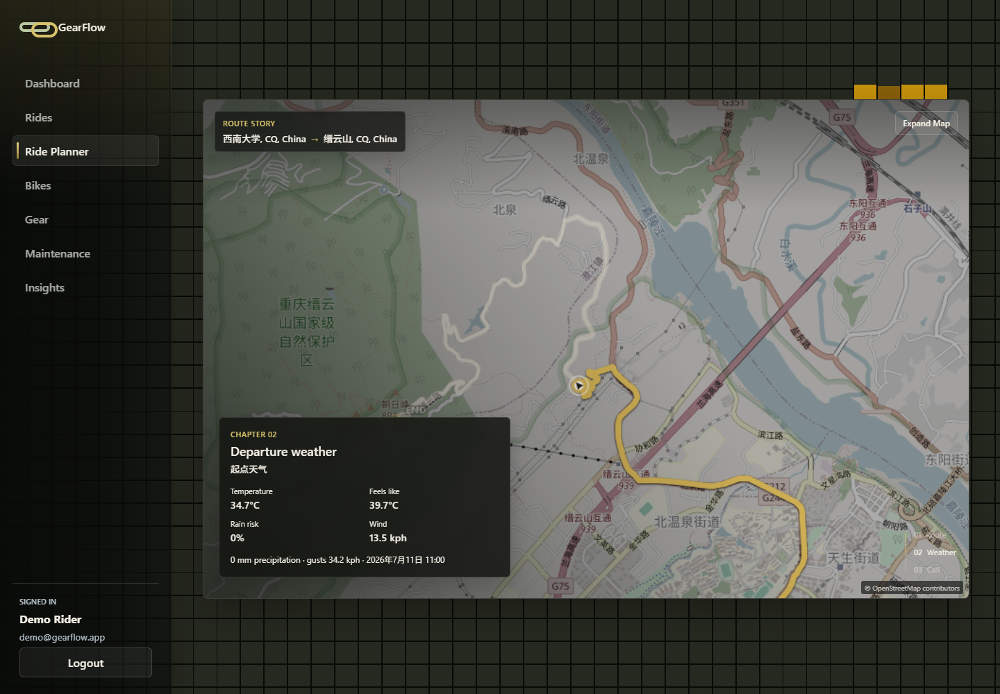
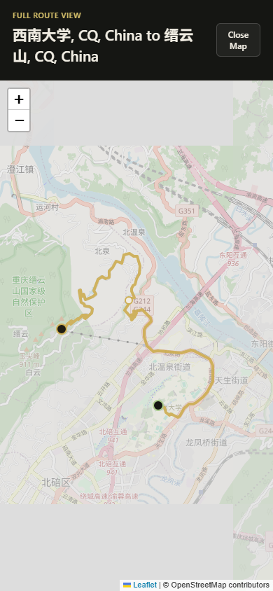
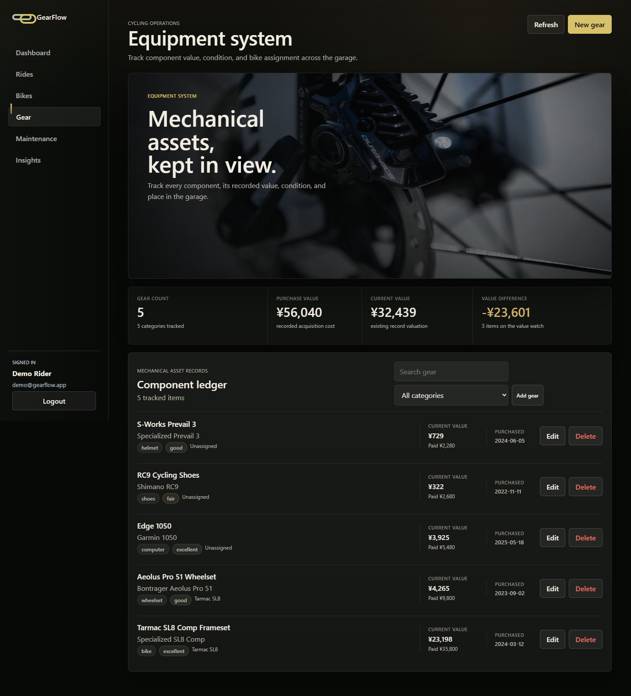
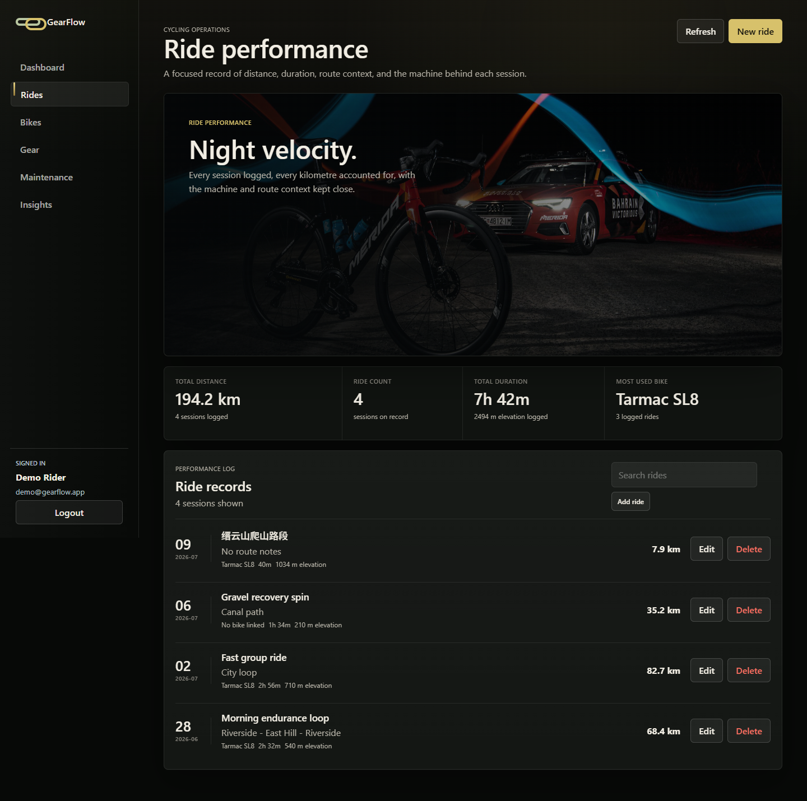
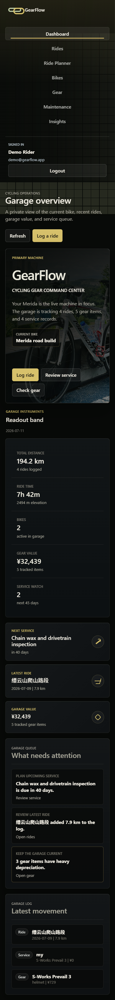

# GearFlow

GearFlow is a full-stack cycling garage: it keeps bikes, ride records, gear assets, maintenance, and upgrade plans in one private performance workshop. The interface pairs a Vue dashboard with a route planner, animated route story, Wavy Cubes background, and smoked-glass panels.

## Online demo

- Site: [http://120.26.32.163/](http://120.26.32.163/)
- Demo account: `demo@gearflow.app`
- Demo password: `ride123`

The demo is currently served over HTTP by IP address. Use it for course review only; do not enter personal credentials.

## Highlights

- HTTP-only cookie authentication with registration, login, logout, and protected views.
- CRUD management for bikes, rides, gear, maintenance, and wishlist items.
- Dashboard and insights generated from persisted MySQL data.
- Gear value preview using local depreciation rules without overwriting stored asset data.
- Ride Planner with place search, road-cycling routes, weather, Leaflet maps, SVG route/rider animation, a three-stage Route Story, and an expanded map dialog.
- Responsive dark cockpit UI with Three.js Wavy Cubes, smoked-glass surfaces, and mechanical page transitions.

## Technology

| Layer | Tools |
| --- | --- |
| Frontend | Vue 3, TypeScript, Vite, GSAP, Three.js, Leaflet |
| Backend | Node.js, Express, cookie-parser, CORS |
| Data | MySQL 8, Prisma |
| Route data | OpenRouteService and Open-Meteo |
| Operations | Nginx and PM2 on Alibaba Cloud ECS |

## Project structure

```text
GearFlow/
├── client/                 # Vue/Vite application
│   └── src/
│       ├── components/     # Ride Planner, Route Story, Wavy Cubes
│       ├── shaders/        # Three.js shader sources
│       └── App.vue         # App shell and view state
├── server/                 # Express API and Prisma integration
│   ├── controllers/
│   ├── routes/
│   ├── services/
│   └── prisma/
├── docs/images/            # Curated README screenshots
└── scripts/                # Local smoke-test helper
```

## Local development

### Prerequisites

- Node.js 20 or later
- npm
- MySQL 8 or a compatible MySQL server
- An OpenRouteService API key for place search and routing

### Install and configure

```bash
npm install
npm install --prefix server
npm install --prefix client
```

Copy the example environment file, then replace its placeholders:

```powershell
Copy-Item server/.env.example server/.env
```

Required values are documented in [`server/.env.example`](server/.env.example). The running app uses `SESSION_SECRET`; `JWT_SECRET` is an explicit placeholder for deployment compatibility and is not consumed by the current cookie-session implementation.

Create a local database and a least-privilege MySQL user, then set `DATABASE_URL` in `server/.env`. For example:

```sql
CREATE DATABASE gearflow CHARACTER SET utf8mb4 COLLATE utf8mb4_unicode_ci;
CREATE USER 'gearflow_user'@'localhost' IDENTIFIED BY 'replace_password';
GRANT SELECT, INSERT, UPDATE, DELETE, CREATE, ALTER, INDEX, DROP, REFERENCES ON gearflow.* TO 'gearflow_user'@'localhost';
FLUSH PRIVILEGES;
```

### Initialize MySQL and start the app

Run the Prisma migration and seed only against a local/development database:

```bash
npm run prisma:generate --prefix server
npm run db:migrate
npm run db:seed
```

Start both services:

```bash
npm run dev
```

- Frontend: `http://localhost:5173`
- Backend API: `http://localhost:3001`
- Health check: `http://localhost:3001/api/health`

Useful checks:

```bash
npm run build
npm run ui:smoke
```

`ui:smoke` expects the local app to be available. The build command generates Prisma Client and builds the Vue application.

## Environment variables

| Variable | Purpose |
| --- | --- |
| `DATABASE_URL` | MySQL Prisma connection URL |
| `PORT` | Express listening port; defaults to `3001` |
| `SESSION_SECRET` | Secret used by the current HTTP-only cookie session |
| `JWT_SECRET` | Reserved placeholder; not read by the current application |
| `ORS_API_KEY` | OpenRouteService key for place search and route generation |
| `DEMO_EMAIL` / `DEMO_PASSWORD` | Seeded demonstration account |
| `COOKIE_SECURE` | Set to `true` only behind HTTPS |

Never commit `server/.env`, database passwords, API keys, or private keys.

## Deployment architecture

```text
Browser
  │ HTTP :80
  ▼
Nginx (SPA fallback)
  ├── static Vue build
  └── /api → Express / PM2 (127.0.0.1 only)
                     │
                     ▼
                MySQL (127.0.0.1 only)
```

The public server exposes only Nginx. The Express API and MySQL remain bound to loopback addresses. A release candidate environment is kept separately during verification so the previous production process and directories can be restored quickly.

## Known limitations

- Route search, route geometry, and weather depend on external OpenRouteService/Open-Meteo availability and an active `ORS_API_KEY`.
- The current public demo uses HTTP rather than HTTPS; set `COOKIE_SECURE=true` only after HTTPS is configured.
- This is a course/private-use project, not a multi-tenant commercial service.

## Screenshots












