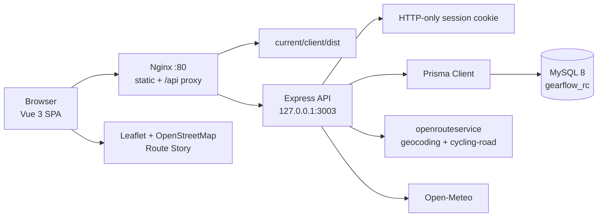
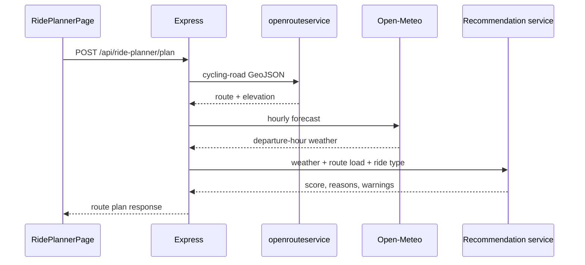

# GearFlow 技术架构

更新时间：2026-07-12
当前发布版本：v1.1.0

本文档以 v1.1.0 源码与已上线架构为准。生产目录、健康检查和回滚命令见 [DEPLOYMENT.md](DEPLOYMENT.md)，上线验证见 [RELEASE-v1.1.0.md](RELEASE-v1.1.0.md)。

## 1. 总体架构



前端以相对 `/api` 请求、`credentials: 'include'` 与 Express 通信。业务数据由 Prisma 写入 MySQL；路线、地点和天气仅由后端访问第三方服务，浏览器 bundle 不包含外部服务密钥。

## 2. 技术栈

| 层级 | 实现 |
| --- | --- |
| 前端 | Vue 3.5、TypeScript、Vite 6 |
| 3D 环境 | Three.js 0.185、InstancedMesh、EffectComposer |
| 地图与路线 | Leaflet、OpenStreetMap、GSAP Route Story 动画 |
| 后端 | Node.js、Express 4 |
| 数据访问 | Prisma 6 |
| 数据库 | MySQL 8 |
| 认证 | HTTP-only Cookie session、`requireAuth` |
| 路线/地点 | openrouteservice |
| 天气 | Open-Meteo |
| 进程与代理 | PM2、Nginx |

本地默认端口为 Vite `5173`、API `3001`；生产 API 通过 `HOST=127.0.0.1` 绑定到 `3003`，只由 Nginx 代理。

## 3. 代码结构

```text
GearFlow/
  client/
    src/
      App.vue
      api.ts
      main.ts
      styles.css
      components/
        DashboardWavyCubes.vue
        RidePlannerPage.vue
        RideRouteStory.vue
      pages/WavyCubesReferencePage.vue
      wavy-cubes-reference/
        Orchestrator.js
        Camera.js
        Renderer.js
        Stage.js
        Effects/
        Utils/
  server/
    server.js
    controllers/
    routes/
    middleware/
    services/
    prisma/
      schema.prisma
      migrations/
      seed.js
    tests/
  scripts/ui-smoke.cjs
  docs/
```

`WavyCubesBackground.vue` 是保留的旧实现，不作为正式应用背景入口。正式生产场景仅使用 `DashboardWavyCubes.vue` 与 `wavy-cubes-reference/` 中参数化后的原始实现。

## 4. 前端应用壳

### 4.1 根层与认证

`App.vue` 的稳定层如下：

```text
App Root
├── DashboardWavyCubes
└── auth-field Transition
    ├── Auth Screen
    └── App Shell
        ├── Sidebar
        └── PageViewport
```

`DashboardWavyCubes` 位于认证条件之外，只创建一个 Orchestrator 实例。登录、登出和页面导航都不会卸载或重建 WebGL 场景。Canvas 使用 `pointer-events: none`，交互由其父层接收，不会阻塞表单、Sidebar、地图或内容操作。

正式主题配置：

```text
background: #090A08
base:       #2D2F2A
highlight:  #D8C47E
rgbShift:   0.003
vignette:   0.38
```

原始参考页位于 `/dev/wavy-cubes-reference`。`main.ts` 在加载 App 全局样式之前按 pathname 分流，因此参考页不继承 GearFlow 样式。参考页使用默认白灰蓝主题；正式主题仅属于各自 Orchestrator 实例，不污染参考页。

### 4.2 Wavy Cubes 渲染链路

当前正式背景保留原始渲染结构：

- Perspective Camera、40×40 InstancedMesh cube grid。
- 128 点 Float `DataTexture` 与 MouseTrail raycast。
- Gaussian wavefront、cosine、jitter、时间/距离衰减。
- `MeshPhongMaterial.onBeforeCompile` 注入高度位移与颜色。
- `customDepthMaterial` 保证阴影随位移同步。
- Ambient、主 Directional、Fill Directional 灯光与阴影。
- `RenderPass → VignetteRGBShiftShader → OutputPass`。
- 实例级 `destroy()` 释放 animation loop、事件、纹理、材质、geometry、composer、renderer、GUI/Stats DOM。

`DashboardWavyCubes.vue` 只负责 Vue mount/unmount、容器尺寸与实例引用清理，不复制 shader 或 Three.js 场景。

### 4.3 内部页面导航

项目不使用 Vue Router。`App.vue` 使用内部视图状态管理：

- `requestedView`：用户最近请求，驱动导航指示器。
- `displayedView`：实际渲染页面。
- `pendingView`：转场期间最后一次请求。
- `isViewTransitioning`：阻止并行转场。
- `pageVisible`：驱动 Vue `<Transition mode="out-in">`。

Route Field Recomposition 只作用于 PageViewport：旧页整体退出、新页整体进入；Sidebar 和 WebGL 背景保持稳定。`gearflow:page-entered` 事件在新页稳定后发送给地图等需要尺寸刷新组件。

`prefers-reduced-motion: reduce` 保留状态同步，但跳过位移、缩放、模糊和 Route Signal。

### 4.4 页面模块

- `App.vue`：登录、应用壳、Dashboard 与 Bikes/Rides/Gear/Maintenance/Insights 的现有 CRUD 视图。
- `RidePlannerPage.vue`：地点搜索、出发时间、骑行目标、整合规划请求和结果摘要。
- `RideRouteStory.vue`：Leaflet 地图、真实 GeoJSON SVG 覆盖、路线回放、Expand/Close Map；收到 `gearflow:page-entered` 后仅在已有地图时 `invalidateSize()`。

## 5. 后端与认证

`server/server.js` 初始化顺序：dotenv、CORS、JSON、cookie parser、公开路由、受保护业务路由、404、统一错误处理。

配置项：

- `PORT` 与 `HOST` 控制监听地址。
- `CORS_ORIGIN` 控制带 Cookie 的允许来源。
- `SESSION_SECRET` 用于 HMAC session cookie。
- `COOKIE_SECURE` 与部署的 HTTP/HTTPS 状态保持一致。

公开接口：

```text
GET /api/health
GET /api/status
/api/auth/*
```

受 `requireAuth` 保护的接口：

```text
/api/dashboard
/api/bikes
/api/rides
/api/ride-planner
/api/gears
/api/maintenance
/api/wishlist
/api/insights
```

控制器在查询与写入时按 `req.user.id` 限制数据所有权。成功响应使用 `{ data: ... }`，错误由统一 `errorHandler` 规范化。

## 6. 数据模型与外部服务

Prisma schema 位于 `server/prisma/schema.prisma`，provider 为 MySQL。核心模型：`User`、`Bike`、`Ride`、`Gear`、`Maintenance`、`WishlistItem`。

路线规划不写数据库：



ORS 负责地点搜索和 `cycling-road` 路线；Open-Meteo 提供小时天气；推荐规则是纯函数，不调用第三方服务也不写数据库。

## 7. 发布与运行

生产目录使用不可变 release：

```text
/www/wwwroot/gearflow/
  releases/<timestamp>/
  shared/server.env
  current -> releases/<timestamp>
```

Nginx 将 `/` 指向 `current/client/dist`，将 `/api/` 代理到本地 PM2 API。生产只允许：

```bash
npx prisma migrate deploy
```

禁止在生产使用 `migrate dev`、`migrate reset`、`db push` 或任何破坏性数据库操作。

详细部署、健康检查、备份与回滚步骤见 [DEPLOYMENT.md](DEPLOYMENT.md)。

## 8. 测试与维护规则

```bash
npm ci
npm test --prefix server
npm run build
npm run ui:smoke
```

`scripts/ui-smoke.cjs` 验证登录页、三次登录/登出、单 Canvas、Dashboard Hero、七页面顺序导航、快速导航最终状态、1280×720、reduced-motion 和截图输出。

维护约束：

- 不提交 `server/.env`、密钥、数据库、发布 artifact 或 Playwright 输出。
- 不修改 Wavy Cubes 的镜头、网格、波纹算法、阴影链路、颜色和后处理参数，除非有单独设计决策。
- 不在客户端暴露 ORS、Open-Meteo 或数据库凭据。
- Three.js 的大 chunk 是已知的非阻断构建警告；不要为消除警告而破坏动态背景。
